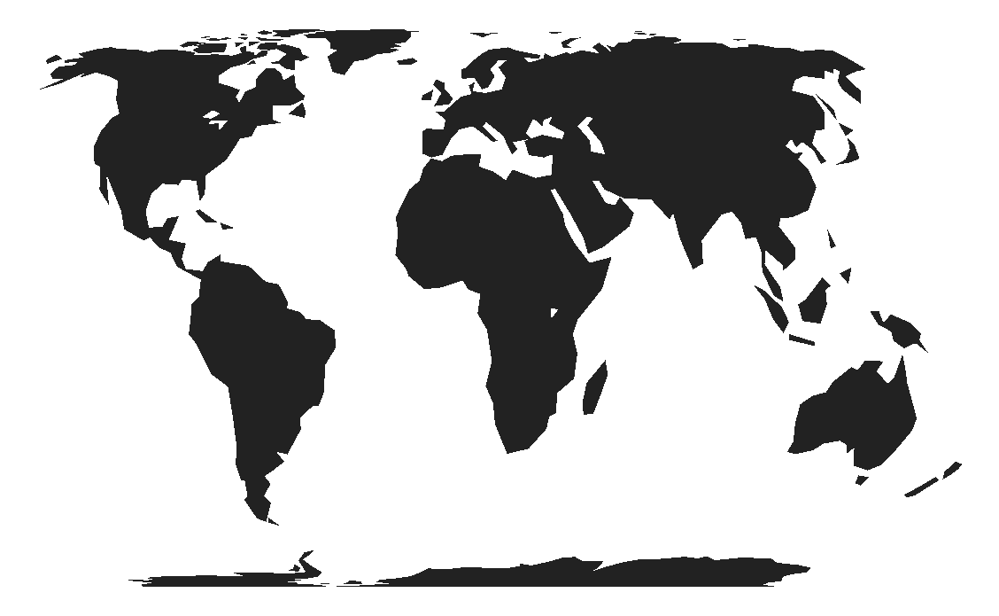
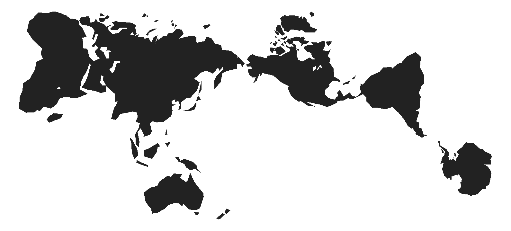
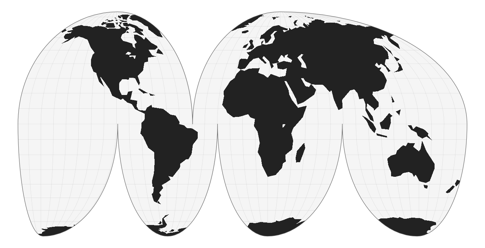
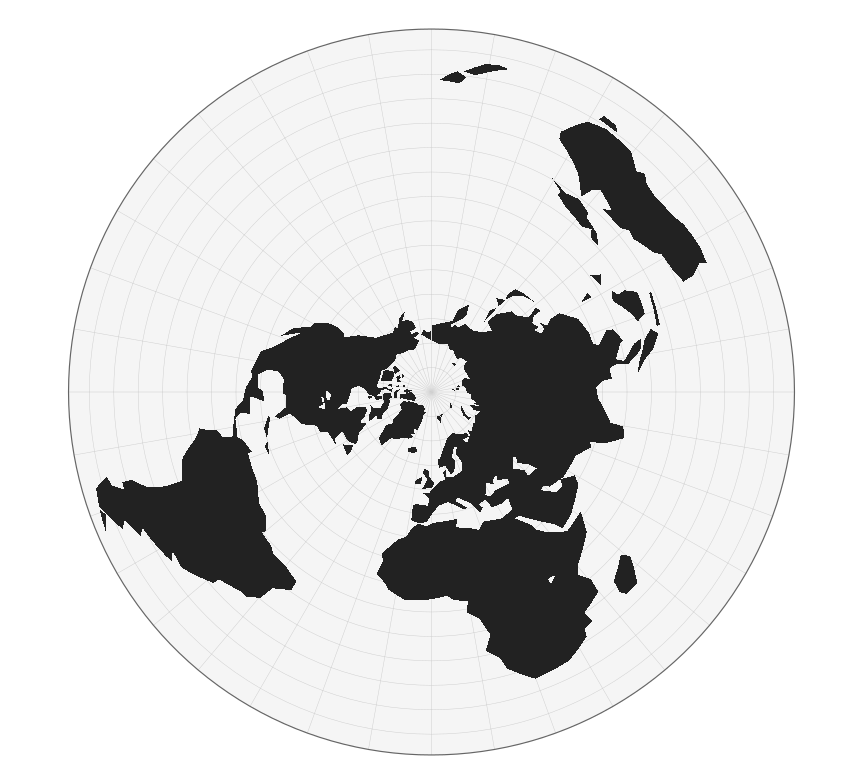
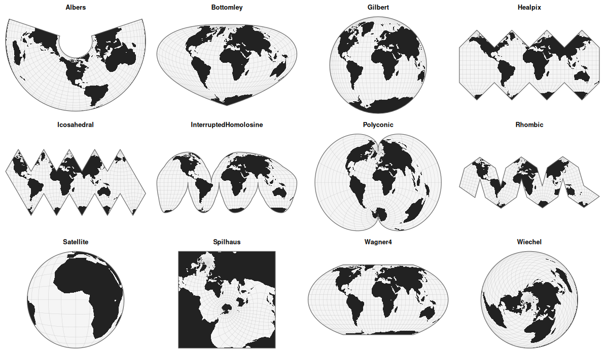

# planisphere 

[](https://riatelab.r-universe.dev/planisphere)
[](https://www.repostatus.org/#active)

**Map projections**

This package provides access to a wide range of map projections. It allows spatial data frames containing geographic coordinates (latitude/longitude) to be projected. Projection calculations are performed using spherical geometry rather than ellipsoidal geodetic models.

## Installation

You can install the released version of `planisphere` from
CRAN with:

``` r
install.packages("planisphere")
```

Alternatively, you can install the development version of `planisphere`
from [r-universe](https://riatelab.r-universe.dev/planisphere)
with:

``` r
install.packages("planisphere", repos = c("https://riatelab.r-universe.dev", "https://cloud.r-project.org"))
```

## Usage

The package provides two main functions.

- `project()` applies a map projection to a spatial dataframe.
- `display()` plot the projected spatial dataframe.

``` r
library(sf)

world <- st_read(
  system.file("gpkg/land.gpkg", package = "planisphere"),
  quiet = TRUE
)
```

``` r
equal <- planisphere::project(x = world, proj = "EqualEarth")
planisphere::display(equal)
```



``` r
imago <- planisphere::project(x = world, proj = "Imago")
planisphere::display(imago)
```



With `additional_layers = TRUE`, you can retrieve, along with the projected
basemap, a list containing the basemap as well as the sphere and graticule
layers. As previoulsy, you can visualize them directly using the `display()`
function.

``` r
mollweide <- planisphere::project(x = world,
                                  proj = "InterruptedMollweide",
                                  additional_layers = TRUE
                                  )
planisphere::display(mollweide)
```



You can customize projections using dedicated parameters. For example, to obtain a polar projection:

``` r
polar <- planisphere::project(x = world,
                                  proj = "AzimuthalEquidistant",
                                  clipAngle = 150,
                                  rotate = c(0, -90),
                                  additional_layers = TRUE
                                  )
planisphere::display(polar)
```



## 117 Projections available

The package provides more than a hundred map projections. To retrieve their names, you can use the `registry()` function.

With the `gallery()` function, you can quickly visualize a set of projections at a glance. By default, the function displays 12 randomly selected projections. Here is an example.



## Under the hood

Under the hood, this package executes JavaScript code. It is built on the V8 engine, using a context with default libraries preloaded. However, you can also create a new context and load additional libraries using the `new_v8_context()` function.

On load, the package exposes the projection functions provided by three JavaScript libraries from the D3 ecosystem. We are grateful to Mike Bostock, Philippe Rivière, Jason Davies, Ricky Reusser, Charles Karney, and all the contributors who have helped develop and maintain these powerful geospatial tools.

- `d3-geo`: https://d3js.org/d3-geo/projection
- `d3-geo-projection`: https://github.com/d3/d3-geo-projection
- `d3-geo-polygon`: https://github.com/d3/d3-geo-polygon

In addition, a custom script for the Spilhaus projection has been added (thanks to Torben Jansen).

For details on the available projections and their parameters, please refer to the documentation of these libraries. It is all the more interesting that you can directly pass a D3 function with all its parameters.

For example

```r
planisphere::projection(x = world, 
                        proj = "AzimuthalEqualArea",
                        rotate = c(-10, -52)
                        )
```

is equivalent to

```r
planisphere::projection(x = world, 
                        proj = "d3.geoAzimuthalEqualArea().rotate([-10, 52])"
                        )
```

This approach can be much more convenient if you are already familiar with the D3 ecosystem and used to working with it.


## Community Guidelines

One can contribute to the package through [pull
requests](https://github.com/riatelab/planisphere/pulls) and report issues or
ask questions [here](https://github.com/riatelab/planisphere/issues)