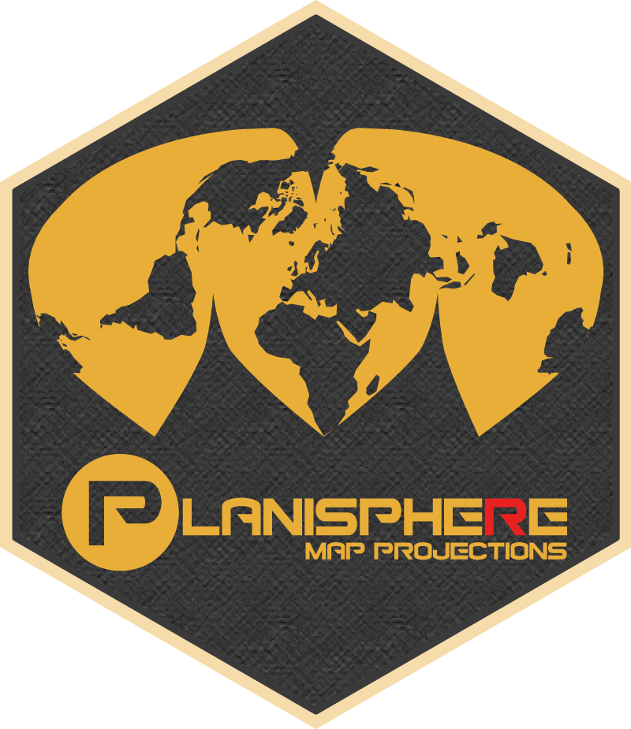

# planisphere 

**Map projections**

This package provides access to a wide range of cartographic projections. Built on the `V8` engine, it wraps the `D3.js` libraries `d3-geo`, `d3-geo-projection`, and `d3-geo-polygon`. Projection calculations are performed using spherical geometry rather than ellipsoidal geodetic models.

## Installation

The package source code is hosted on GitHub and can be installed using the `remotes` package.

``` r
install.packages("remotes")
remotes::install_github("riatelab/planisphere")
```

## Usage

The package provides three main functions.

- `init()` initializes the V8 engine and loads the required JavaScript libraries.
- `project()` applies a map projection to geometries.
- `display()` renders the projected result.

``` r
library(sf)

world <- st_read(
  system.file("gpkg/land.gpkg", package = "planisphere"),
  quiet = TRUE
)
```

``` r
ct <- planisphere::init()
result <- planisphere::project(ct, x = world, proj = "geoInterruptedMollweide")
planisphere::display(result)
```

These three operations can be chained using the pipe operator `|>`.

``` r
planisphere::init() |> 
  planisphere::project(x = world, proj = "geoInterruptedMollweide") |>
  planisphere::display()
```

## What projection functions can I use?

By défault, the projection functions available in this package are those provided by the three underlying JavaScript libraries. Please refer to the documentation of these libraries to see what is available.

- `d3-geo`: https://d3js.org/d3-geo/projection
- `d3-geo-projection`: https://github.com/d3/d3-geo-projection
- `d3-geo-polygon`: https://github.com/d3/d3-geo-polygon

For example, in the package, you can directly use `"d3.geoRhombic()"`, or simply `"geoRhombic"` or `"Rhombic"`. Be careful: uppercase and lowercase letters are important.

All projection functions are configurable. For example, to obtain a polar projection, you can write:


``` r
planisphere::project(ct, x = world, proj = "d3.geoAzimuthalEquidistant().rotate([0, -90]).clipAngle(150)")
```

or

``` r
planisphere::project(ct,
                     x = world,
                     proj = "AzimuthalEquidistant",
                     rotate = c(0, -90),
                     clipAngle = 150"
                     )
```


