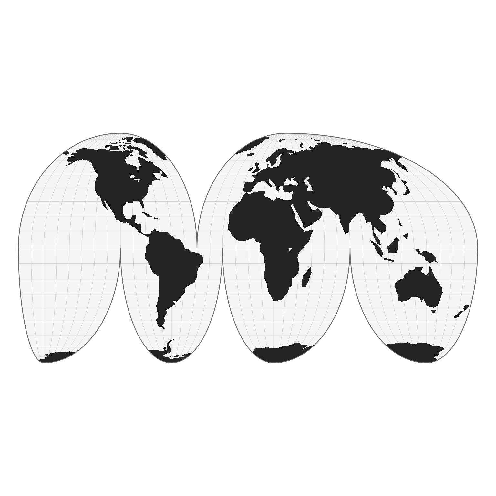
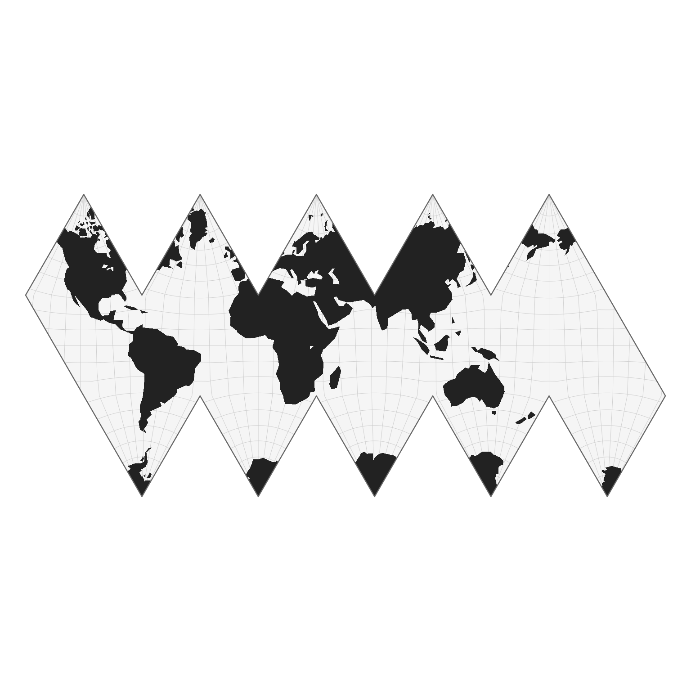
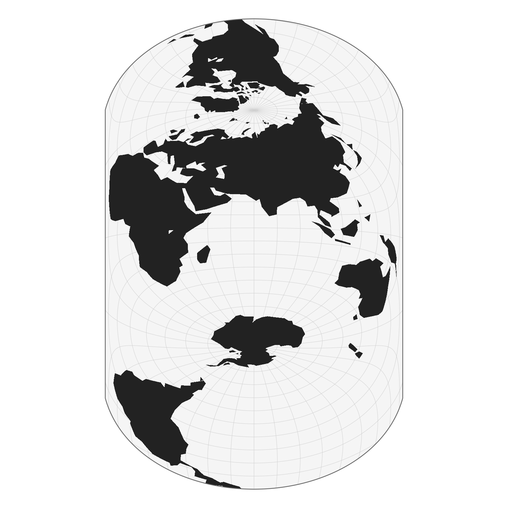

# Hello planisphere

**`Planisphere`** is an R package that transforms geographic spatial
data frames (latitude–longitude coordinates) into projected spatial data
frames using a variety of map projections.


## 1 - Preliminary remarks

### What are map projections?

The Earth is a sphere (more precisely, a geoid), a three-dimensional
object floating in space. Yet the maps we use every day are flat: they
exist in two dimensions, on paper or on a screen. To move from this
curved reality to a flat representation, we need to transform
coordinates expressed on the globe in latitude and longitude into
Cartesian coordinates on a plane. This is not a simple flattening
operation: it relies on a mathematical transformation known as a **map
projection**, which converts the curved surface of the Earth into a flat
map. Projections are generally classified according to the geometric
surface used as an intermediate step : cylindrical, conic, or azimuthal,
each offering a different way of “wrapping” the globe before unfolding
it.

However, this transformation inevitably introduces distortions. In a
way, it is similar to trying to press the peel of an orange onto a flat
table. No matter how carefully you proceed, the surface cannot lie flat
without consequences: it will stretch in some places, compress in
others, and may even tear or fold if forced. The same fundamental
constraint applies to the Earth’s surface when projected onto a plane.
No projection can preserve all geometric properties at once, meaning
that distances, areas, shapes, or directions are always altered to some
degree, depending on the chosen projection and its purpose.

### Geodesic vs Spherical model

The Earth is not a perfect sphere; in geodesy it is more accurately
approximated by an ellipsoid. This refinement accounts for the slight
flattening at the poles and provides the mathematical foundation for
high-precision geospatial computations. However, in the planisphere
package, **we adopt a spherical model** of the Earth for simplicity and
consistency with its visual and geometric goals. If you need to work
directly with ellipsoidal models and geodesic accuracy, other tools such
as GDAL or PROJ are more appropriate, as they operate on ellipsoidal
Earth representations.

### D3.js librariries

Under the hood, the package relies on a set of JavaScript libraries from
the D3 ecosystem. First, **d3-geo** provides the fundamental building
blocks for spherical geometry, including coordinate transforms and a set
of standard map projections. **d3-geo-projection** extends this system
with a wider collection of projection methods, including discontinuous
projections. Finally, **d3-geo-polygon** focuses on spherical polygon
operations: it introduces additional projections that rely on polygon
clipping.

- <https://d3js.org/d3-geo/projection>
- <https://github.com/d3/d3-geo-projection>
- <https://github.com/d3/d3-geo-polygon>

## 2 - How it works?

``` r
# install.packages("remotes")
# remotes::install_github("riatelab/planisphere")
```

``` r
library(planisphere)
```

``` r
# Data Loading
library(sf)
```

    ## Linking to GEOS 3.12.1, GDAL 3.8.4, PROJ 9.4.0; sf_use_s2() is TRUE

``` r
world <- st_read(
  system.file("gpkg/land.gpkg", package = "planisphere"),
  quiet = TRUE
)
```

``` r
ct <- planisphere::init()
```

    ## Loading JavaScript libraries

    ## ✔ https://cdn.jsdelivr.net/npm/d3@7

    ## ✔ https://cdn.jsdelivr.net/npm/d3-geo@3

    ## ✔ https://cdn.jsdelivr.net/npm/d3-geo-projection@4

    ## ✔ https://cdn.jsdelivr.net/npm/d3-geo-polygon@1

``` r
result <- planisphere::project(ct, x = world, proj = "geoInterruptedMollweide")
```

    ## D3.js projection used: d3.geoInterruptedMollweide().scale(6378137)

``` r
planisphere::display(result)
```



``` r
result <- planisphere::project(ct, x = world, proj = "geoIcosahedral") |> 
  display()
```

    ## D3.js projection used: d3.geoIcosahedral().scale(6378137)



## xxx

``` r
hao <- planisphere::project(ct,
                            x = world,
                            proj = "geoHufnagel",
                            a = 0.8,
                            b = 0.35,
                            psiMax = 50,
                            ratio = 1.6,
                            angle = 90,
                            rotate = c(110, -200, 90))
```

    ## D3.js projection used: d3.geoHufnagel().rotate([110,-200,90]).scale(6378137).a(0.8).b(0.35).psiMax(50).ratio(1.6).angle(90)

``` r
display(hao)
```


