# Map projections

In this document, we explore map projections: what they are, why they
are used, and how they are implemented in the `planisphere` package. We
begin with the basic concepts behind cartographic projections and their
role in representing the Earth’s curved surface on a flat map. We then
look at how these projections can be used in practice within
`planisphere` to create a wide range of map visualizations.

In short, this document combines a bit of theory with a bit of practice
to help you understand and work with map projections in R.

Let’s get started!

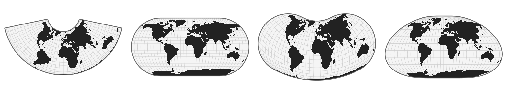

## What are map projections?

The Earth is a sphere (more precisely, a geoid), a three-dimensional
object floating in space. Yet the maps we use every day are flat: they
exist in two dimensions, on paper or on a screen. To move from this
curved reality to a flat representation, we need to transform
coordinates expressed on the globe in latitude and longitude into
Cartesian coordinates on a plane. This is not a simple flattening
operation: it relies on a mathematical transformation known as a **map
projection**. Projections are generally classified according to the
geometric surface used as an intermediate step : **cylindrical**,
**conic**, or **azimuthal**, each offering a different way of “wrapping”
the globe before unfolding it.

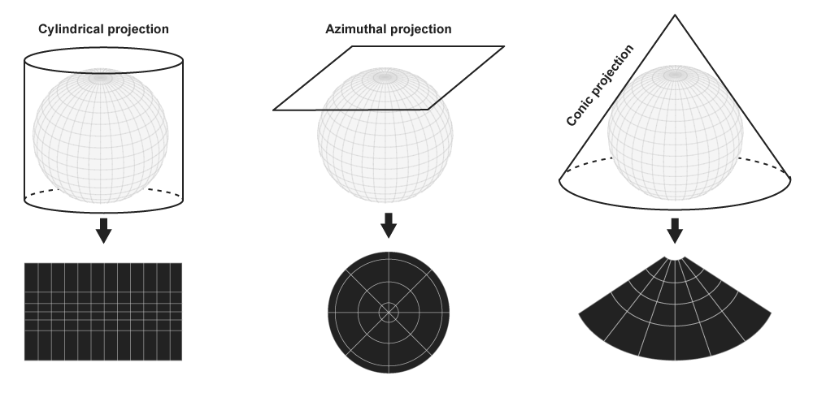

Beyond classical geometric constructions, there is also a family of
**pseudoprojections**, which are not based on a strict developable
surface but are instead defined analytically to reduce and balance
distortions. This category includes pseudocylindrical, pseudoconical,
and pseudoazimuthal projections, which relax geometric constraints in
order to produce more visually or statistically balanced representations
of the world. Closely related are **discontinuous projections**, which
introduce intentional breaks or cuts in the map (typically along
selected meridians or regions) in order to manage and redistribute
distortion, improving the representation of key areas at the expense of
global continuity. Finally, some approaches rely on more **piecewise
mathematical constructions**, such as polyhedral projections, where the
globe is first mapped onto a polyhedron (e.g., an icosahedron or a cube)
before being unfolded into the plane.

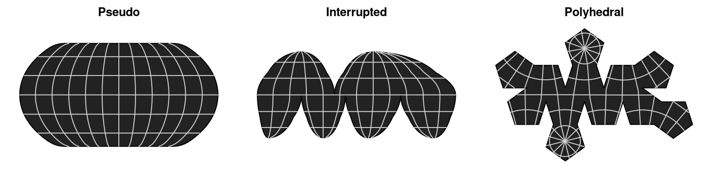

However, map projections inevitably introduces distortions. In a way, it
is similar to trying to press the peel of an orange onto a flat table.
No matter how carefully you proceed, the surface cannot lie flat without
consequences: it will stretch in some places, compress in others, and
may even tear or fold if forced. The same fundamental constraint applies
to the Earth’s surface when projected onto a plane. No projection can
preserve all geometric properties at once, meaning that distances,
areas, shapes, or directions are always altered to some degree,
depending on the chosen projection and its purpose. These distortions
can be visualized using **Tissot’s indicatrix**, a diagnostic tool that
represents how infinitesimal circles on the globe are transformed into
ellipses on the map, making it possible to assess locally how a
projection deforms angles, areas, and shapes across space.

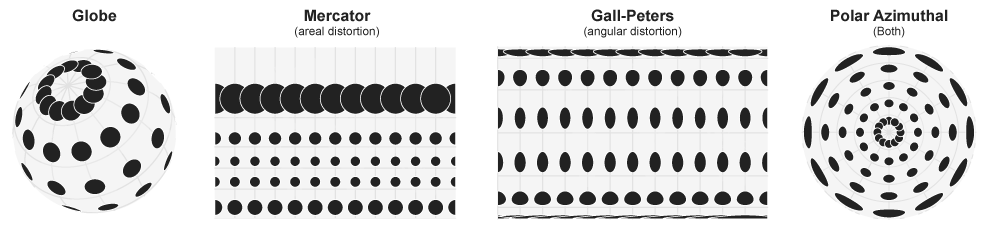

## Geodesic vs Spherical model

The Earth is not a perfect sphere; in geodesy it is more accurately
approximated by an ellipsoid. This refinement accounts for the slight
flattening at the poles and provides the mathematical foundation for
high-precision geospatial computations. However, in the `planisphere`
package, **we adopt a spherical model** of the Earth for simplicity and
consistency with its visual and geometric goals. It is more than
sufficient for producing maps at a global scale. If you need to work
directly with ellipsoidal models and geodesic accuracy, other tools such
as GDAL or PROJ are more appropriate, as they operate on ellipsoidal
Earth representations.

## The `planisphere` package

The planisphere package provides more than one hundred map projections.
These are grouped into different categories: “cylindrical”, “conic”,
“azimuthal”, “perspective”, “pseudocylindrical”, “interrupted”,
“polyhedral”, “quincuncial”, “regional”, “pseudoazimuthal”, and
“miscellaneous”. You can retrieve their names and visualize them using
the
[`registry()`](https://rneocarto.github.io/planisphere/reference/registry.md)
and
[`gallery()`](https://rneocarto.github.io/planisphere/reference/gallery.md)
functions.

Let’s take a look at the available projections.

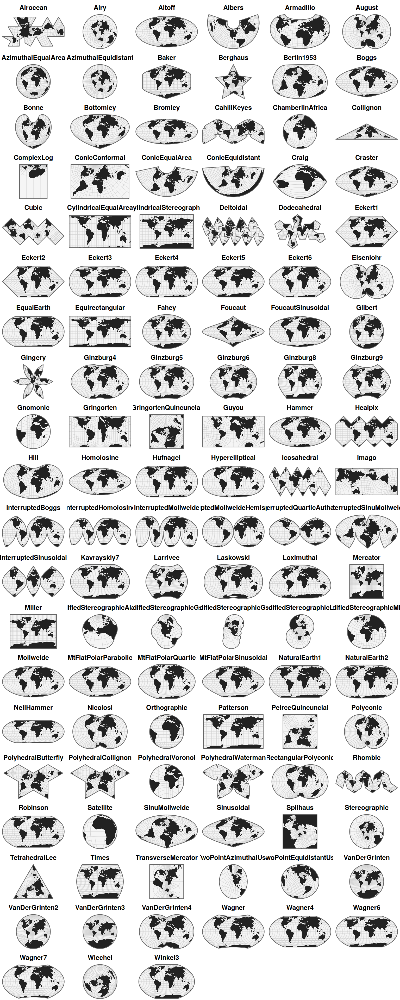

## Project a baseamap

The main function of the package is
[`project()`](https://rneocarto.github.io/planisphere/reference/project.md),
which can be used to project any spatial data frame.

Let’s load a world basemap.

``` r
library(sf)
world <- st_read(
  system.file("gpkg/land.gpkg", package = "planisphere"),
  quiet = TRUE
)
```

We can now project it.

``` r
spilhaus <- planisphere::project(world, proj = "Spilhaus",
                                 additional_layers = TRUE)
```

The `additional_layers` parameter allows you to retrieve, together with
the projected basemap, the sphere and the graticules. We can visualize
the whole set using the
[`display()`](https://rneocarto.github.io/planisphere/reference/display.md)
function.

``` r
planisphere::display(spilhaus,  title = "Spilhaus")
```

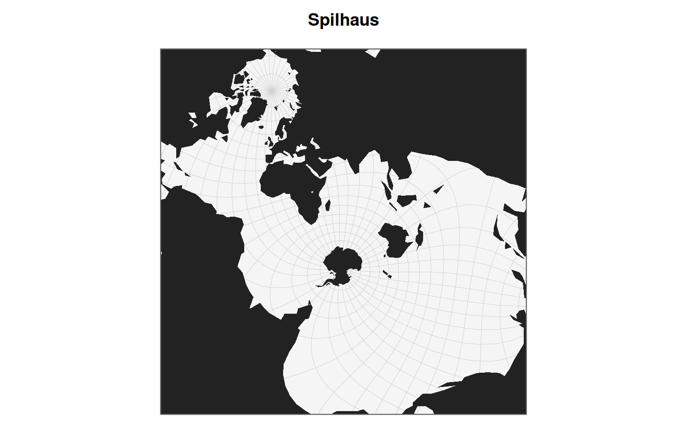

## Custom projections

Projection functions accept many parameters that allow projections to be
customized. Here are some examples of what is possible.

- Peirce Quincuncial

Charles Sanders Peirce developed his quincuncial projection in 1879. The
name refers to the way the four quadrants of the world are arranged in a
square around a central hemisphere. In its standard form, the projection
is centered on the North Pole, which gives greater emphasis to the
Northern Hemisphere.

``` r
peirceN <- planisphere::project(
                            x = world,
                            proj = "PeirceQuincuncial",
                            rotate = c(-25, -90),
                            additional_layers = TRUE
                            )

peirceS <- planisphere::project(
                            x = world,
                            proj = "PeirceQuincuncial",
                            rotate = c(-25, 90, 180),
                            additional_layers = TRUE
                            )
```

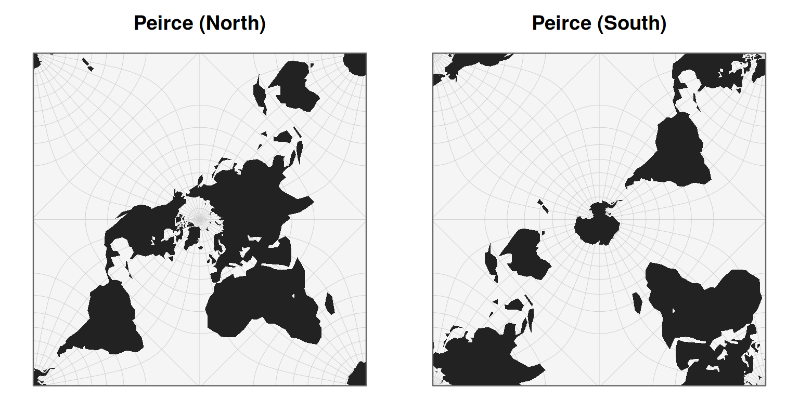

- Gall-Peters

The Gall–Peters projection, popularized in 1973 by Arno Peters and
originally based on the work of James Gall in the 19th century, is an
equal-area cylindrical map projection that preserves relative surface
areas while significantly distorting shapes. It is often contrasted with
the Mercator projection (1569), which preserves angles but exaggerates
the size of high-latitude regions. In its “inverted” versions, the map
is flipped along the north–south axis, placing the Southern Hemisphere
at the top. This does not alter the mathematical properties of the
projection, but it challenges conventional map orientation and the
symbolic hierarchy embedded in standard world representations.

``` r
peters <- planisphere::project(
                            x = world,
                            proj = "CylindricalEqualArea",
                            parallel = 45,
                            rotate = c(167, 180),
                            additional_layers = TRUE
                            )
```

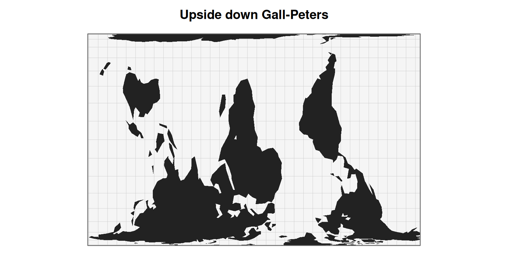

- Polar projection

The polar projection, popularized in the mid-20th century by Richard
Edes Harrison in the 1940s, represents the world from a top-down view
centered on the North Pole. It highlights the continuity of landmasses
and oceans around the Arctic rather than the usual east–west framing.
This type of projection was widely disseminated through the United
Nations emblem, adopted in 1945, which is based on an azimuthal
equidistant projection centered on the North Pole, symbolizing a world
without a dominant center.

``` r
polar <- planisphere::project(
                            x = world,
                            proj = "geoAzimuthalEquidistant",
                            clipAngle = 150,
                            rotate = c(0, -90),
                            additional_layers = TRUE
                            )
```

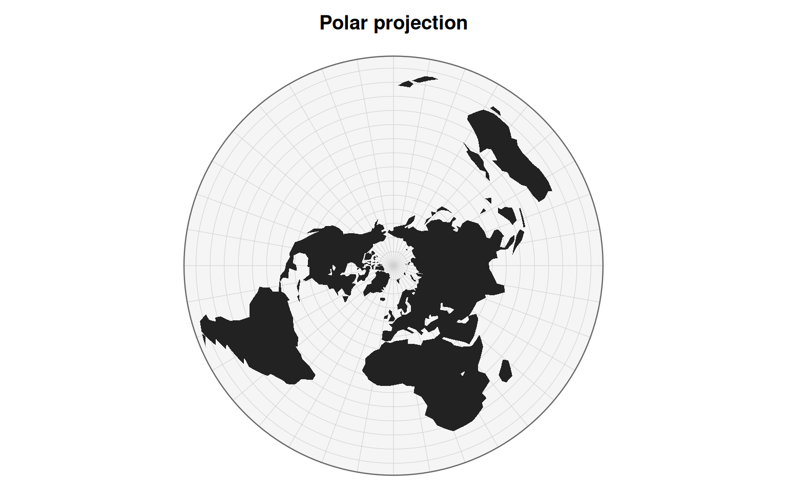

- Hao Xiaoguang projection

Hao Xiaoguang is a Chinese cartographer known for developing modern
equal-area world map projections that aim to preserve area relationships
while reducing visual distortion. His work is part of a contemporary
approach to alternative world map design, seeking more balanced
representations that are less centered on Euro-American cartographic
conventions.

``` r
hao <- planisphere::project(
                            x = world,
                            proj = "geoHufnagel",
                            a = 0.8,
                            b = 0.35,
                            psiMax = 50,
                            ratio = 1.6,
                            angle = 90,
                            rotate = c(110, -200, 90),
                            additional_layers = TRUE
                            )
```

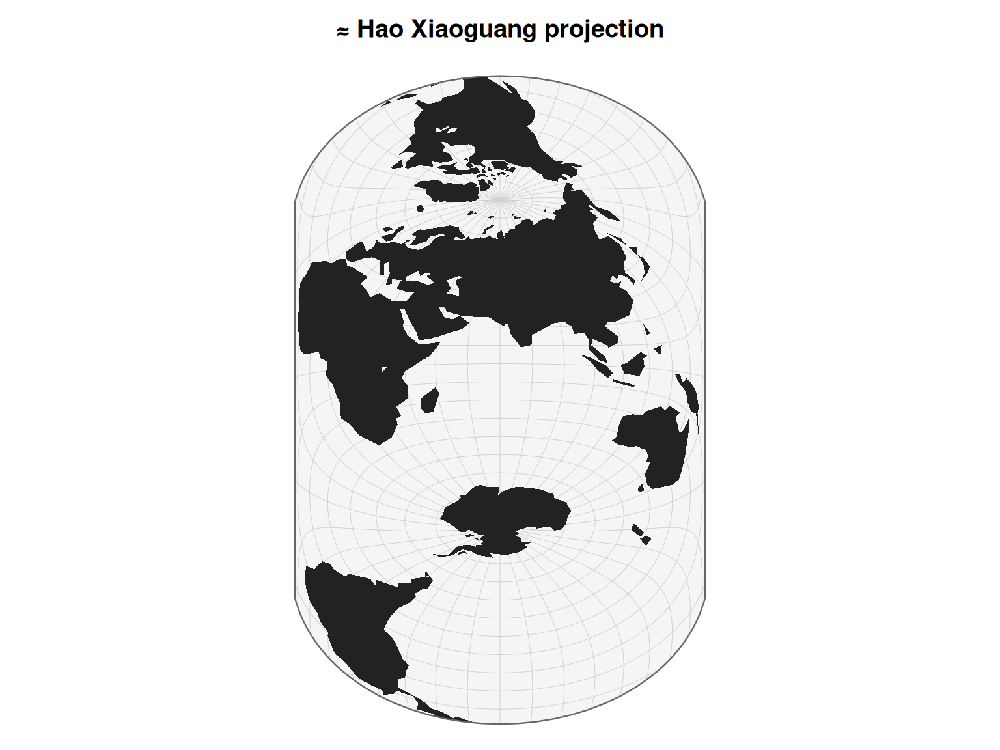

## A last trick

The spherical model is less accurate than the geodesic model.
Nevertheless, it can still provide a fairly good approximation of
standard map projections. Let’s look at two geographic areas: France and
Europe.

First, let’s retrieve some data online.

``` r
europe <- sf::st_read("https://gisco-services.ec.europa.eu/distribution/v2/nuts/gpkg/NUTS_RG_20M_2024_4326_LEVL_0.gpkg", quiet = TRUE) |>
 sf::st_crop(xmin=-10, xmax=45, ymin=25, ymax=72)
france <- europe[europe$ISO3_CODE == "FRA",]
```

- Europe (LAEA)

The Lambert azimuthal equal-area (LAEA) projection is an azimuthal
projection centered on a point located in the heart of Europe,
officially defined around (10°E, 52°N). From this center, directions are
preserved, and areas are represented accurately. It is the official
projection used in Europe. In planisphere, this projection can be
reproduced using the “AzimuthalEqualArea” projection by adjusting the
`rotate` parameter.

``` r
laea = planisphere::project(europe, 
                            proj = "AzimuthalEqualArea", 
                            rotate = c(-10, -52)
                            )
```

- France (Lambert 93)

The Lambert 93 projection is a conformal conic projection officially
used in France for cartographic and geospatial applications. In
`planisphere`, it can be reproduced using a conic projection by
specifying the appropriate `parallels` and `center` parameters for
metropolitan France. Because ConicConformal function produce artifacts
outside the area of interest, the `clipExtent` parameter has to be used
to properly clip the resulting map. Please refer to the d3.js
documentation to understand how this mechanism works.

``` r
lambert93 <- planisphere::project(france, 
                                 proj = "ConicConformal", 
                                 rotate = c(-3,0), 
                                 center = c(0, 46.5),
                                 parallels = c(44,49),
                                 clipExtent =  list(c(0, 0), c(1000, 1000))
                                 )
```

Et voilà!

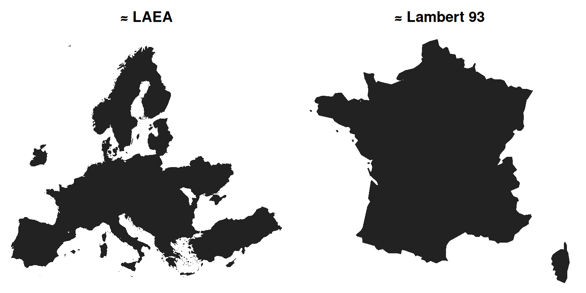
